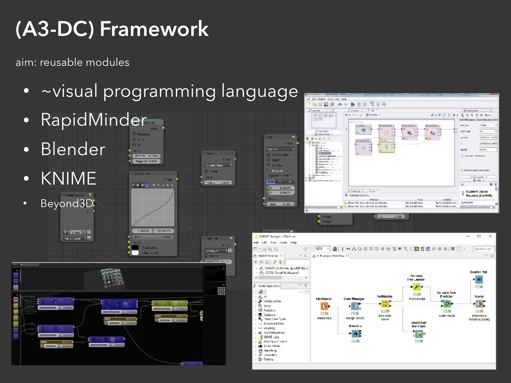

# Doxygen

Install `doxygen` ([http://www.doxygen.nl](http://www.doxygen.nl)) and run in this directory, it will use the `Doxyfile` to generate searchable class reference documentation.
	
	doxygen

The output `html` directory contains `index.html` you should start with.

# System Overview

## Inspiration



## Layers


	
## System Context


## Containers


## Application Components


## DevOps Components


# Selected Topics

## MultiDimImage

`src/core/multidim_image_platform`


## New Python Module

The directory `src/app/modules/examples` constains examples of creating new modules. Please read `src/app/modules/examples/readme.txt`.

A basic module:

```python
# 1)
# import the interface to the A3-DC application
# note that it only works when the Python code is
# executed from the A3-DC Application
import a3dc_module_interface as a3


# 6) define the functionality of the module
def module_main(ctx):
    # get the value of the inputs
    x = a3.inputs['an image input']
    y = a3.inputs['string parameter']

    # ...
    # Here comes the actual funcionality
    # ...

    # output the results
    a3.outputs['output number'] = 42
    # ...


# 2) define the inputs and its type
inputs = [
    a3.Input('an image input', a3.types.ImageFloat),
    a3.Input('some generic python object', a3.types.GeneralPyType)]

# 3) define the parameters and its type, optionally set hints
parameters = [
    a3.Parameter('string parameter', a3.types.string),
    a3.Parameter('an int', a3.types.int8),
    a3.Parameter('so filename', a3.types.url),
    a3.Parameter('much float', a3.types.float)
      .setFloatHint('min', -0.5)
      .setFloatHint('unusedValue', -0.2),
    a3.Parameter('so enum', a3.types.enum)
      .setIntHint("option1", 0)
      .setIntHint("option2", 1)
      .setIntHint("option3", 42)]

# 4) define the outputs and its type
outputs = [
    a3.Output('output volume', a3.types.ImageFloat),
    a3.Output('output number', a3.types.float)]

# 5) create a list of the inputs, parameters and outputs
config = []
config.extend(inputs)
config.extend(parameters)
config.extend(outputs)

# 7) set the module process function and config
a3.def_process_module(config, module_main)
```

## New Native Module

TODO

## Introducing a New Port Type

TODO